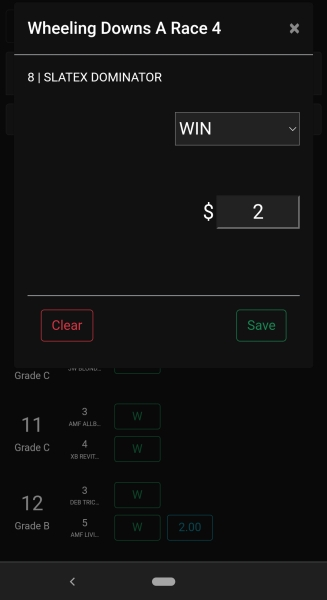
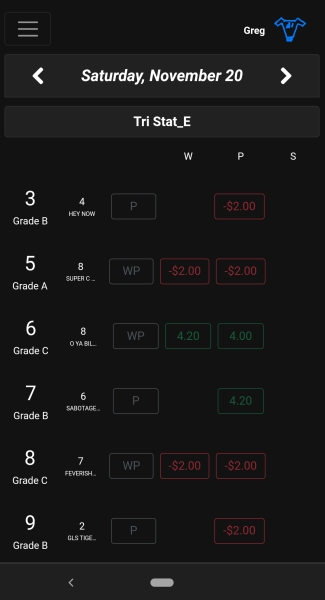

This program generates daily predictions for greyhound races, and records bets that are placed. This website is live and in use.

Here's how it works:

1. It first gathers historical data for all greyhound races at each of the active tracks in the US. All the information that is available on a racing program is recorded.

2. Using Python Weka Wrapper, I analyzed all data over the past three years and found the best results using a J48 classifier.

3. With the parameters of the ideal Weka classifier determined, I built daily cronjobs to create data for the following day's races. Weka then creates a model using the most recent race data. Each dog is assigned a predicted finish, and an additional model translates those predictions into recommended bets.

4. The "Front Page" of the website shows today's races. It is structured as closely as possible to an actual betting kiosk. Only dogs with recommended bets are displayed.

5. A user clicks on a bet to purchase and enters an amount wagered. After results are gathered, a "Completed Races" table displays which bets were successful. A user can easily navigate to see results from previous days.

Planned Updates:

Currently running simulations to establish profitability of exotic wagers (exacta, trifecta, etc)

